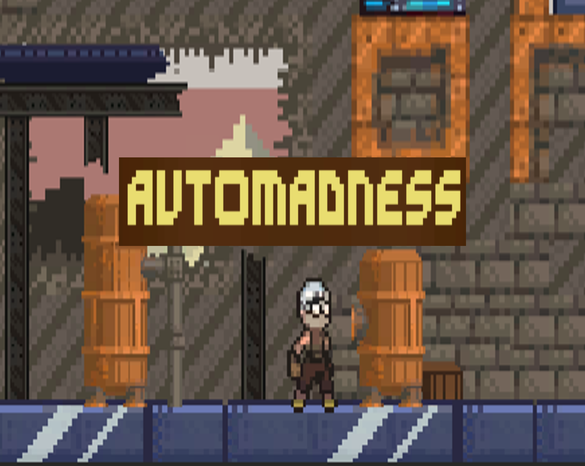

# AutoMadness
Jogo 2D desenvolvido por Ana Carolina Souza e Guilherme Rameh

---

## Sobre o jogo
Jogo Tower Defense frontal baseado em estética steampunk.

[Milanote](https://app.milanote.com/1PF1A91haiNdcd?p=WBl8CGhIKxQ) com o GDD do jogo  
[Itch.io](https://acsouza2398.itch.io/automadness)  
[Gameplay](https://youtu.be/5Dg7QRpDXUk)

## Referências de código
 - [Unity UI Tutorial - Create a Health Bar in 90 Seconds](https://www.youtube.com/watch?v=mi_SP0sippI)
 - [2D Enemy Shooting Unity Tutorial](https://www.youtube.com/watch?v=--u20SaCCow)
 
 ### Bug Conhecido
 Ao compilar o jogo em WebGL, o prefab responsável pelos inimigos no tracker da tela nao consegue ser instanciado. Ao rodar o jogo localmente no Unity, esse mesmo prefab funciona corretamente. O link para o gameplay acima reflete o ocorrido no Unity, conforme implementado.
